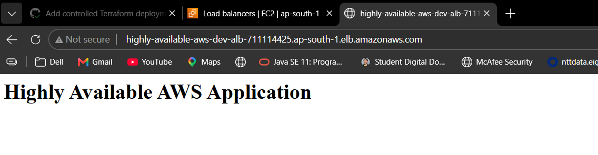
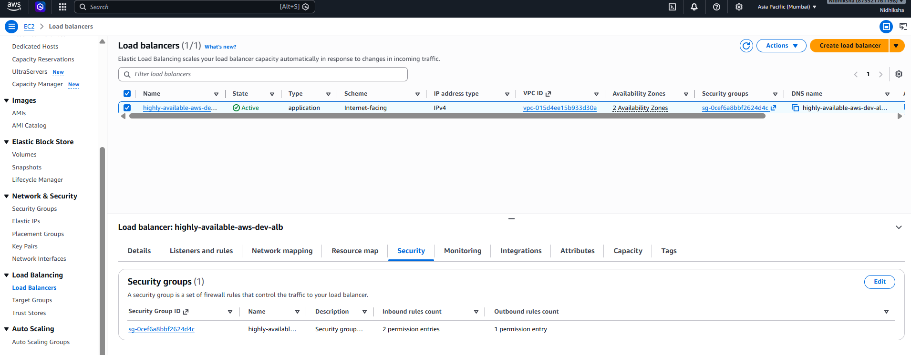
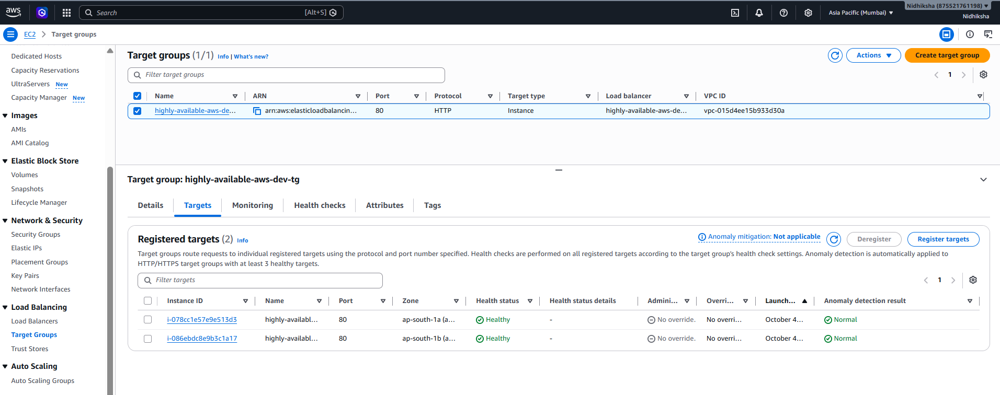
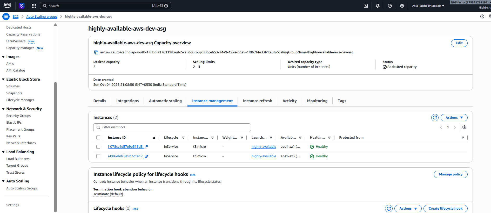
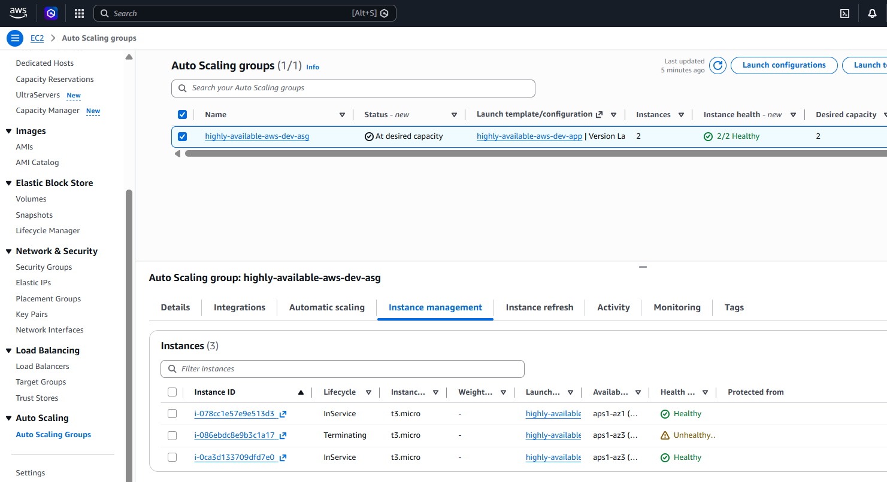
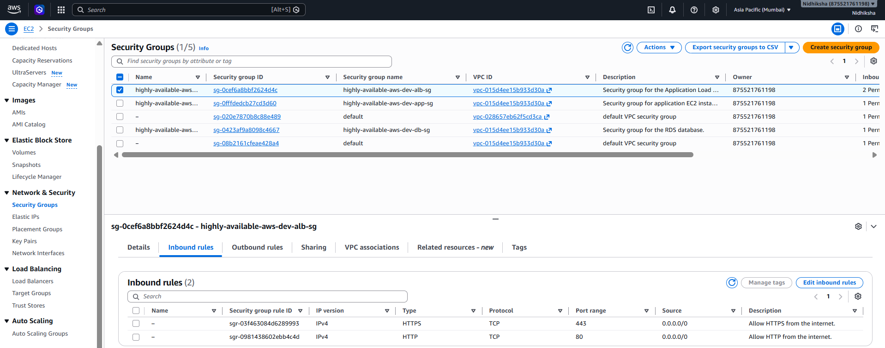
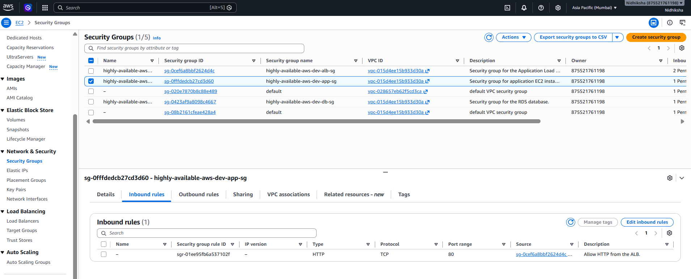
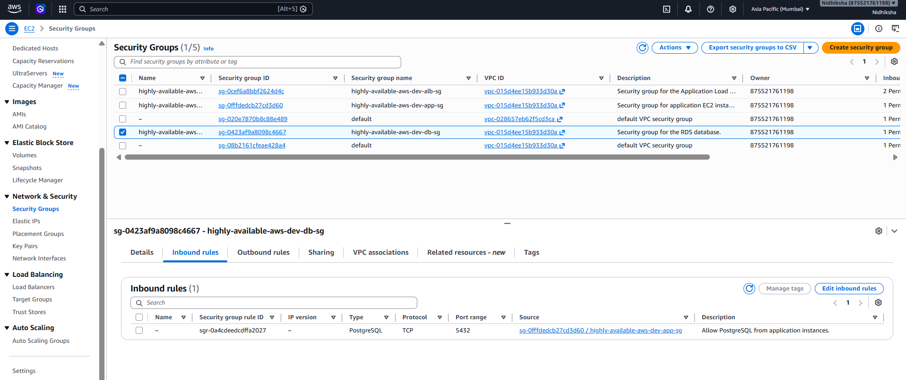
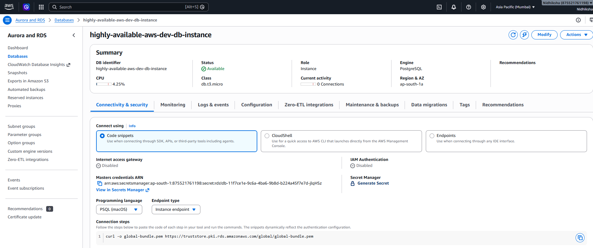
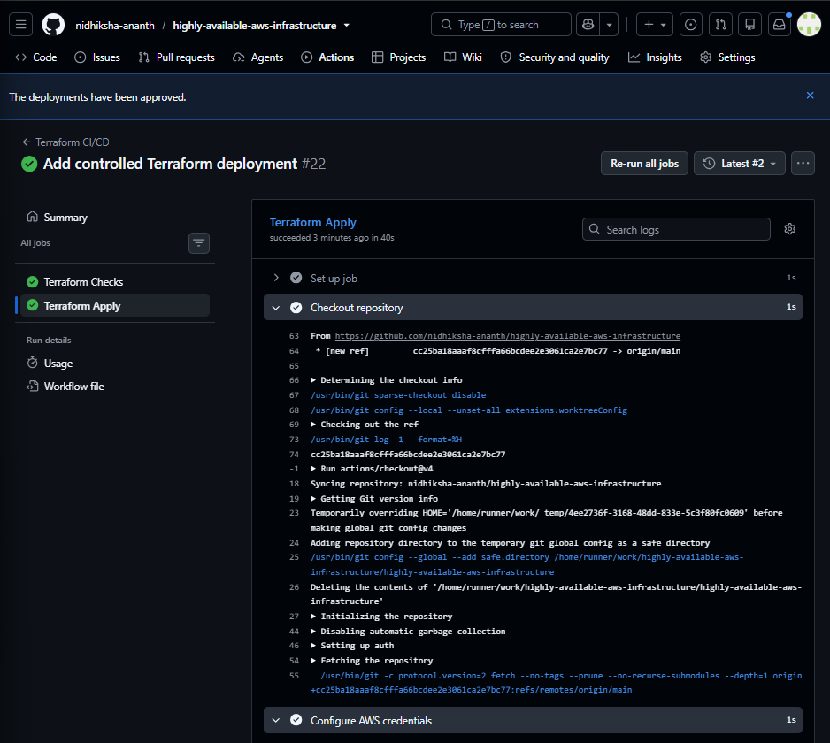

# Highly Available AWS Infrastructure with Terraform

I built this project to get hands-on experience designing and managing AWS infrastructure with Terraform.

The main focus was on building an application environment where the application servers are private, traffic comes through a load balancer, the database is isolated from the internet, and the infrastructure can be recreated through code.

I also wanted to understand how Terraform, AWS networking, IAM, Auto Scaling, monitoring, remote state, and CI/CD fit together.

---

## Architecture

```text
                              Internet
                                  |
                                  v
                         +----------------+
                         |      ALB       |
                         |  Public Subnets|
                         +-------+--------+
                                 |
                    +------------+------------+
                    |                         |
                    v                         v
             +-------------+           +-------------+
             | EC2 / ASG   |           | EC2 / ASG   |
             | Private AZ1 |           | Private AZ2 |
             +------+------+           +------+------+
                    |                         |
                    +------------+------------+
                                 |
                                 v
                         +----------------+
                         | RDS PostgreSQL |
                         | Private DB     |
                         +----------------+

                    NAT Gateway per AZ
              for private application outbound traffic
```

The Application Load Balancer is deployed across two Availability Zones.

The EC2 Auto Scaling Group runs instances in private application subnets across the two Availability Zones.

The RDS database is placed in private database subnets and is not publicly accessible.

---

## AWS Services Used

* Amazon VPC
* Public and private subnets
* Internet Gateway
* NAT Gateway
* Application Load Balancer
* EC2
* EC2 Auto Scaling
* Amazon RDS PostgreSQL
* IAM
* CloudWatch
* Amazon S3
* GitHub Actions
* GitHub OIDC

---

## Network Design

The VPC uses:

```text
VPC
10.0.0.0/16
```

### Public subnets

```text
10.0.1.0/24
10.0.2.0/24
```

Used by the Application Load Balancer.

### Private application subnets

```text
10.0.11.0/24
10.0.12.0/24
```

Used by the EC2 Auto Scaling Group.

### Private database subnets

```text
10.0.21.0/24
10.0.22.0/24
```

Used by RDS.

The application subnets have a NAT Gateway in each Availability Zone so that private EC2 instances can access the internet for outbound traffic without becoming publicly accessible.

The database subnets do not have a direct route to the internet.

---

## Traffic Flow

The application traffic follows this path:

```text
Internet
   |
   | HTTP / HTTPS
   v
 ALB
   |
   | HTTP : 80
   v
 EC2 instances
   |
   | PostgreSQL : 5432
   v
 RDS
```

There is no direct internet access to the EC2 instances or RDS.

---

## Security Groups

I separated the Security Groups based on the traffic flow.

### ALB Security Group

Allows:

```text
HTTP  80   from 0.0.0.0/0
HTTPS 443  from 0.0.0.0/0
```

### Application Security Group

Allows:

```text
HTTP 80 from the ALB Security Group
```

### Database Security Group

Allows:

```text
PostgreSQL 5432 from the Application Security Group
```

This means the database doesn't need to allow traffic from the internet or from arbitrary IP addresses.

---

## EC2 and Auto Scaling

The EC2 instances are created using a Launch Template.

The Launch Template uses Amazon Linux and installs Nginx through EC2 user data.

The current development Auto Scaling configuration is:

```text
Minimum instances: 2
Desired instances: 2
Maximum instances: 4
CPU target:        50%
```

The instances are distributed across the two private application subnets.

I used target tracking based on average CPU utilization. When the workload increases, Auto Scaling can launch additional instances, and when demand decreases, it can scale back down.

---

## Application Load Balancer

The ALB is deployed in the public subnets.

It forwards traffic to the EC2 instances through a target group.

The target group performs health checks against:

```text
/
```

The ALB only sends traffic to healthy targets.

This also helped me test the failure recovery behavior of the application tier.

---

## High Availability Test

I didn't want to rely only on Terraform successfully creating the resources, so I performed a basic failure test.

Initially:

```text
ASG instances:   2
Healthy targets: 2
```

I manually terminated one EC2 instance.

During recovery, the Auto Scaling Group detected that the desired capacity was no longer available and started a replacement instance.

The ALB continued serving traffic through the remaining healthy instance.

After the replacement instance passed its health check:

```text
ASG instances:   2
Healthy targets: 2
```

So the recovery flow was:

```text
EC2 failure
    |
    v
ALB removes unhealthy target
    |
    v
Remaining instance continues serving traffic
    |
    v
ASG launches replacement
    |
    v
Replacement passes health check
    |
    v
2 healthy targets restored
```

This was a useful practical test because it demonstrated the interaction between the ALB health checks and Auto Scaling rather than just testing the individual resources separately.

---

# RDS PostgreSQL

The database runs inside private database subnets.

Current development configuration:

```text
Engine:              PostgreSQL
Database:            appdb
Instance class:      db.t3.micro
Storage:             20 GB gp3
Publicly accessible: No
```

The RDS subnet group spans two Availability Zones.

The current development RDS instance is configured as:

```text
Multi-AZ: No
```

I kept this configuration cost-conscious for the development environment.

For a production environment, I would enable RDS Multi-AZ and use stronger backup and deletion settings.

---

# IAM

The EC2 instances use an IAM role rather than storing AWS credentials on the instance.

The EC2 role is attached through an instance profile.

The role includes the permissions required for CloudWatch Agent functionality.

For GitHub Actions, I used GitHub OIDC instead of storing long-lived AWS access keys in GitHub.

There are separate IAM roles for:

```text
Terraform CI
Terraform Deployment
```

The CI role is used for Terraform initialization, validation, and planning.

The deployment role is used for infrastructure changes.

Separating these roles reduces the permissions available to the CI process and limits the blast radius if one role is compromised.

---

# Terraform Structure

I organized Terraform into reusable modules and separate environment directories.

```text
terraform/
│
├── environments/
│   │
│   ├── dev/
│   │   ├── backend.tf
│   │   ├── main.tf
│   │   ├── providers.tf
│   │   ├── variables.tf
│   │   ├── outputs.tf
│   │   ├── versions.tf
│   │   └── terraform.tfvars.example
│   │
│   └── prod/
│       └── ...
│
└── modules/
    ├── vpc/
    ├── security_groups/
    ├── alb/
    ├── ec2/
    ├── autoscaling/
    ├── rds/
    ├── iam/
    └── cloudwatch/
```

The modules contain reusable infrastructure logic.

The environment directories are used for environment-specific configuration.

The `dev` environment is the environment I deployed and tested on AWS.

The `prod` environment structure is present for future expansion.

---

# Terraform Remote State

Terraform state is stored remotely in Amazon S3 instead of only on my local machine.

The state bucket has:

* Versioning enabled
* Server-side encryption
* Public access blocked
* Terraform state locking enabled

The backend uses Terraform's S3 state locking with a lock file.

This prevents multiple Terraform operations from modifying the state at the same time.

---

# GitHub Actions CI/CD

I added a GitHub Actions workflow to automate Terraform checks and deployment.

The CI stage runs:

```text
terraform fmt -check
terraform init
terraform validate
terraform plan
```

If the checks pass, the deployment stage can run.

The deployment job uses a separate IAM role and is protected by a GitHub environment approval.

The current flow is:

```text
Git Push
   |
   v
GitHub Actions
   |
   v
Terraform Format
   |
   v
Terraform Init
   |
   v
Terraform Validate
   |
   v
Terraform Plan
   |
   v
Manual Approval
   |
   v
Terraform Apply
```

Both the CI and deployment jobs authenticate to AWS using GitHub OIDC.

No long-lived AWS access keys are stored in the repository.

---

# GitHub OIDC

Instead of creating an AWS access key and secret for GitHub Actions, I configured an AWS IAM OIDC identity provider for GitHub.

The workflow receives temporary credentials through OIDC.

This removes the need to store permanent AWS credentials in GitHub.

The deployment role is also restricted to the GitHub environment used by the deployment workflow.

---

# Monitoring

I configured a CloudWatch alarm for application EC2 CPU utilization.

The alarm configuration includes:

```text
Metric:             CPUUtilization
Threshold:          70%
Period:             5 minutes
Evaluation periods: 2
```

The Auto Scaling target and CloudWatch alarm have different purposes.

Auto Scaling uses:

```text
Target CPU: 50%
```

to make scaling decisions.

CloudWatch uses:

```text
CPU > 70%
```

as a monitoring and alerting condition.

---

# SLA, SLI and SLO

I also defined basic reliability targets for the application instead of describing it as "highly available" without measurable goals.

## SLI — Service Level Indicators

SLIs are the measurements used to understand how the service is performing.

| SLI               | Measurement                     |           Target |
| ----------------- | ------------------------------- | ---------------: |
| Availability      | Successful application requests |          ≥ 99.9% |
| HTTP success rate | 2xx/3xx responses               |          ≥ 99.9% |
| Healthy targets   | ALB healthy EC2 targets         |       2 normally |
| CPU utilization   | Average application CPU         |       Around 50% |
| High CPU          | Sustained CPU above threshold   | Investigate >70% |
| Recovery          | EC2 replacement after failure   |        Automated |

These are engineering targets for this project and are not long-term production measurements.

## SLO — Service Level Objectives

The initial SLO targets are:

```text
Application availability: 99.9%
HTTP success rate:        99.9%
Normal healthy targets:   2
Minimum EC2 instances:    2
Maximum EC2 instances:    4
Target CPU utilization:   50%
High CPU alarm:           70%
```

A 99.9% monthly availability target allows approximately:

```text
30 days
× 24 hours
× 60 minutes
= 43,200 minutes

0.1% of 43,200 minutes
= 43.2 minutes
```

So a 99.9% SLO corresponds to approximately **43 minutes of allowable unavailability per 30-day month**.

This is a target, not a claim that the project has already achieved 99.9% measured availability.

## SLA — Service Level Agreement

There is no contractual SLA for this project because it is a portfolio project rather than a customer-facing production service.

The 99.9% number is therefore an **SLO**, not a guaranteed SLA.

For a real production service, availability would be calculated from actual monitoring data over time.

---

# Reliability and Capacity Numbers

Some of the main infrastructure numbers are:

```text
VPC CIDR                 10.0.0.0/16
Availability Zones       2
Public subnets           2
Private app subnets      2
Private DB subnets       2
NAT Gateways              2
Minimum EC2 instances     2
Desired EC2 instances     2
Maximum EC2 instances     4
CPU scaling target        50%
CPU alarm threshold       70%
RDS storage               20 GB
ALB health check           /
Health check interval     30 seconds
Alarm period              5 minutes
Alarm evaluations         2
```

---

## Screenshots

### Application



### Application Load Balancer



### ALB Healthy Targets



### Auto Scaling Group



### Auto Scaling After Recovery



### Target Group After Recovery


### Security Groups







### RDS



### GitHub Actions



---

# Running the Project

## Prerequisites

You need:

* AWS account
* AWS CLI
* Terraform
* Git
* AWS credentials/profile with the required permissions

## Initialize Terraform

```bash
cd terraform/environments/dev
terraform init
```

## Configure variables

Create a local `terraform.tfvars` file using:

```text
terraform.tfvars.example
```

The actual `terraform.tfvars` file is ignored by Git.

Example:

```hcl
ami_id                 = "your-ami-id"
instance_type          = "t3.micro"
target_cpu_utilization = 50
```

## Format

```bash
terraform fmt -recursive
```

## Validate

```bash
terraform validate
```

## Plan

```bash
terraform plan
```

## Apply

```bash
terraform apply
```

## Destroy

When the environment is no longer required:

```bash
terraform destroy
```

I recommend destroying the development infrastructure when it isn't being used because NAT Gateways and RDS can generate AWS charges.

---

# Current Project Status

The development environment has been deployed and tested on AWS.

Completed:

* VPC and subnet architecture
* Multi-AZ application networking
* NAT Gateways
* Security Groups
* EC2 Launch Template
* EC2 Auto Scaling
* Application Load Balancer
* RDS PostgreSQL
* IAM roles
* CloudWatch monitoring
* S3 remote Terraform state
* Terraform state locking
* GitHub OIDC
* Separate CI and deployment IAM roles
* GitHub Actions CI
* GitHub Actions deployment
* Manual deployment approval
* EC2 failure/recovery test
* Final Terraform plan with no configuration drift

---

# Production Improvements

The current environment is designed primarily as a development/portfolio environment.

Before using it for a real production workload, I would make several changes:

* Enable RDS Multi-AZ
* Increase RDS backup retention
* Enable deletion protection
* Require final database snapshots
* Configure HTTPS using ACM
* Add CloudWatch dashboards
* Add more application and infrastructure alarms
* Move application secrets to AWS Secrets Manager
* Use a saved Terraform plan artifact between CI and deployment
* Further restrict the deployment IAM policy based on the exact resources required
* Add automated infrastructure testing
* Add a dedicated production GitHub environment
* Add stricter production deployment approvals

---

# What I Learned

The biggest part of this project for me was understanding how the individual AWS services fit together.

Some of the things I worked with were:

* Designing a VPC with public and private subnet tiers
* Using Security Groups to control application traffic
* Keeping EC2 instances private behind an ALB
* Using Auto Scaling for failure recovery
* Using health checks to control ALB traffic
* Managing infrastructure through Terraform modules
* Managing Terraform state remotely
* Using state locking
* Setting up GitHub Actions for Terraform
* Using OIDC instead of long-lived AWS credentials
* Separating CI and deployment permissions
* Testing infrastructure failure instead of only testing successful deployment
* Thinking about reliability using SLI, SLO and SLA concepts

The application itself is intentionally simple Nginx.

The main purpose of the project is the infrastructure around the application rather than the application code.
